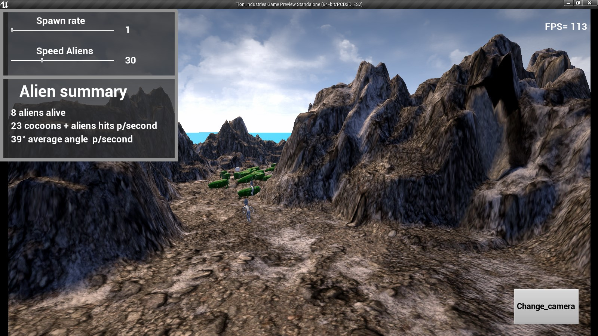

# Rama Desktop y Android, ABRIR con Unreal Engine 4.27

## Puedes descargar los ejecutables o jugar directo en el navegador desde aqui.

Prueba unreal engine multiplataforma

Mover elementos UI para cambiar cantidad de jugadores y velocidad.

Change camera para cambiar de camara.

ESC para salir del juego en modo desktop

More information
Install instructions
Para windows existen dos versiones una con altos graficos que usa DirectX12 y una con bajos gráficos que usa OPENGL3.1. Son muy parecidas, pero en la de altos gráficos hay "PostProcess" con lens flare,neblina entre otros.

La version DIRECTX12  DESKTOP  tiene una menor tasa de FPS pero mayor calidad gráfica.

La version OPENGL 3.1 DESKTOP tiene una mayor tasa de FPS pero menor calidad gráfica.

-----> Descargar descomprimir y ejecutar "Tlon_industries.exe" <------
---------------------------------------------------------------------------------------------------------

Android con  OPENGL 3.1, dispositivos gama media, también funciona en un emulador Android llamado LDPlayer. Tendria que funcionar los objetos de UI correctamente con los touch.

https://kone9.itch.io/unreal-test-instance-with-ia-and-interface-manipulation